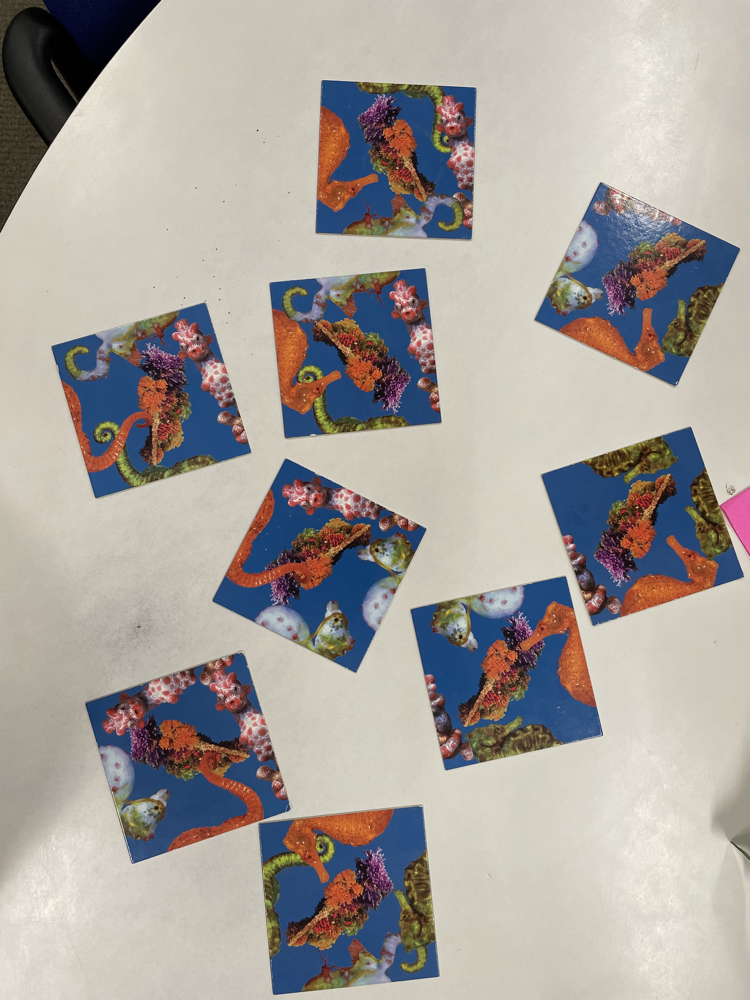

# Seahorse (Hippocampus) puzzle

### Nine tiles
* Need to match the seahorse tail and head on the tile edge
* Four different seahorses
* One tile can be placed at any position in a 3-by-3 grid with four orientations.
* Total possibility: 9!*4^9 ~= 100 billion
* Only ONE correct pattern

### [Answer](./Puzzle_after.jpg)

### Script:
* Main.m: 
    * a backward searching algorithm from the middle position
