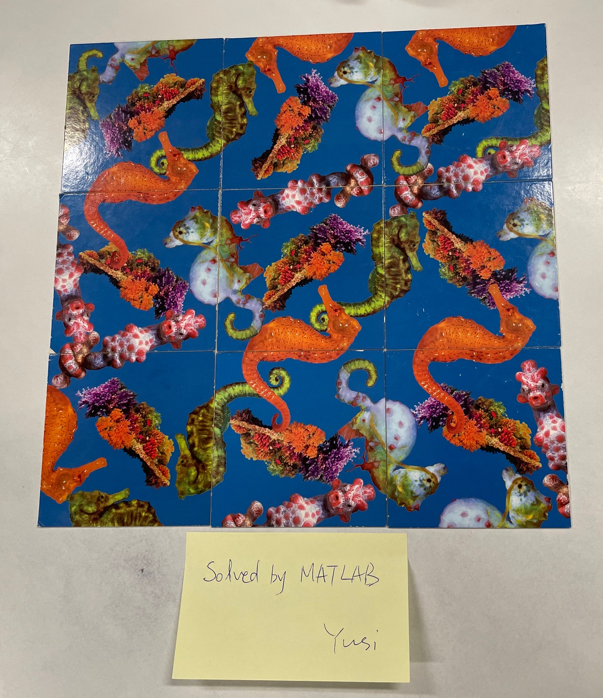

# Seahorse (Hippocampus) puzzle

### Nine tiles
* Need to match the seahorse tail and head on the tile edge
* Four different seahorses
* One tile can be placed at any position in a 3-by-3 grid with four orientations.

